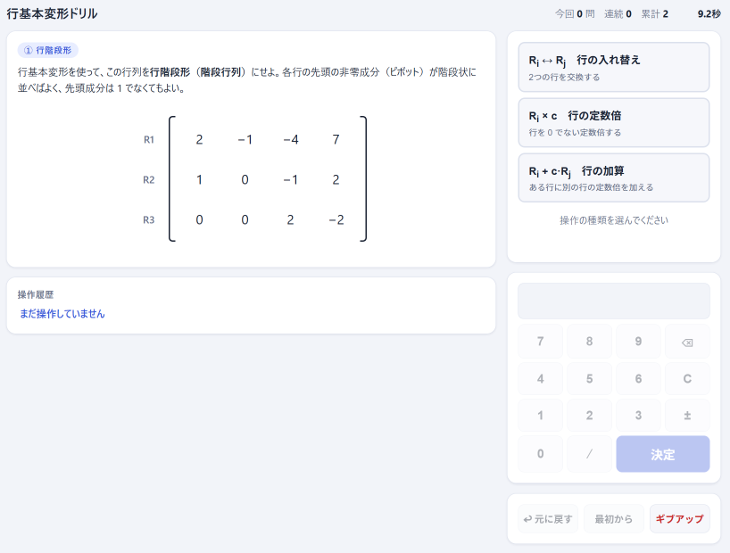

# 行基本変形ドリル

線形代数の**行基本変形**を、繰り返し解いて体で覚えるためのWebアプリです。
ランダムに出題される問題をマウス操作だけでテンポよく解き、掃き出し法の手順を高速化することを目的としています。

行基本変形をはじめとする行列の計算は、正しい手順と多くの四則演算が必要になります。
初学者はこのうち四則演算に時間がかかって、手順を十分身につける前に集中力を失ってしまうことがあります。
そこで四則演算を自動計算することで、手順だけを繰り返し練習できるアプリを作成しました。

## 使い方

### Web

https://aike.github.io/ertdrill/

### ローカル実行

`index.html` をブラウザで開くだけで動きます。インストール・ビルド・サーバーは不要です(単一HTMLファイル、外部依存なし)。

## 問題の種類

4種類の問題がシャッフルされて巡回出題されます。

| タイプ | 内容 | 完成条件 |
|---|---|---|
| ① 行階段形 | 3×4行列を行階段形(階段行列)にする | 各行の先頭の非零成分が階段状に並ぶ(先頭は1でなくてもよい) |
| ② 簡約化 | 行階段形の行列を行簡約階段形(RREF)にする | 各ピボットが1で、ピボット列の他の成分がすべて0 |
| ③ 連立方程式 | 拡大係数行列を変形して連立一次方程式を解く | 行列全体がRREF(左側が単位行列)になる |
| ④ 逆行列 | 拡大係数行列 [A \| I] を変形して A⁻¹ を求める | 左側が単位行列になる(右側が A⁻¹) |

- ③は2元・3元の連立方程式が混在し、解は必ず一意で整数です。
- ④は2×2・3×3が混在し、det A = ±1 になるよう生成するため逆行列も小さい整数になります。
- 問題は「きれいな完成形に基本変形をランダム適用して崩す」方式で生成するので、成分は絶対値9以下に収まり、必ず手頃な逆算経路が存在します。

## 操作方法

すべてマウスで操作します。キーボード入力はありません。

1. 右パネルで操作の種類を選ぶ
   - **Rᵢ ↔ Rⱼ 行の入れ替え**
   - **Rᵢ × c 行の定数倍**(c ≠ 0)
   - **Rᵢ + c·Rⱼ 行の加算**
2. 行列の行(またはR1などのラベル)をクリックして対象の行を選ぶ
3. 係数が必要な操作では画面のテンキーで入力して「決定」
   - 「⁄」キーで分数(例: 1⁄3)、「±」で符号を入力できます

そのほかのボタン:

- **↩ 元に戻す** — 直前の操作を取り消し(何手でも戻れます)
- **最初から** — 出題時の行列に戻す
- **ギブアップ** — 解答例を表示して次の問題へ(連続正解記録はリセット)
- **次の問題 ▶** — クリアまたはギブアップ後に次の問題を出題

## ドリル機能

- 問題ごとの**タイマー**と**操作回数**を計測
- **今回のセッションの解答数**、**連続正解数**、**累計解答数**をヘッダーに表示
- 問題タイプ別の**自己ベストタイム**を記録(ブラウザのlocalStorageに保存、更新時に「自己ベスト!」表示)
- 操作履歴を `R2 ← R2 − 3·R1` の形式でログ表示

## 実装メモ

- 単一ファイル(`index.html`)のみ。HTML/CSS/JavaScriptがすべて含まれ、外部ライブラリは使いません
- 行列の成分は**有理数(分数)の厳密計算**で扱うため、浮動小数点誤差は発生しません
- ダークモード対応(OSの設定に追従)
- スクリプトの数学ロジック部(分数演算・問題生成・REF/RREF判定・掃き出し)はDOM非依存で書かれており、Node.jsから読み込んで自動テストできます

## LICENSE

MIT
